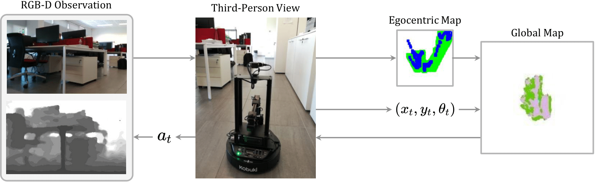
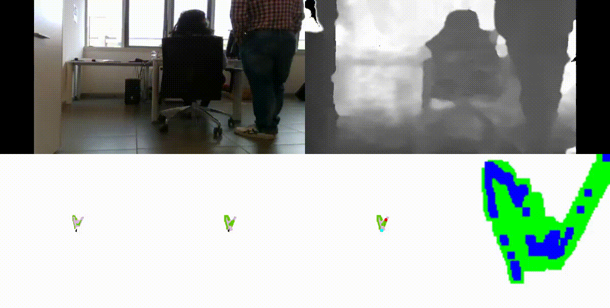
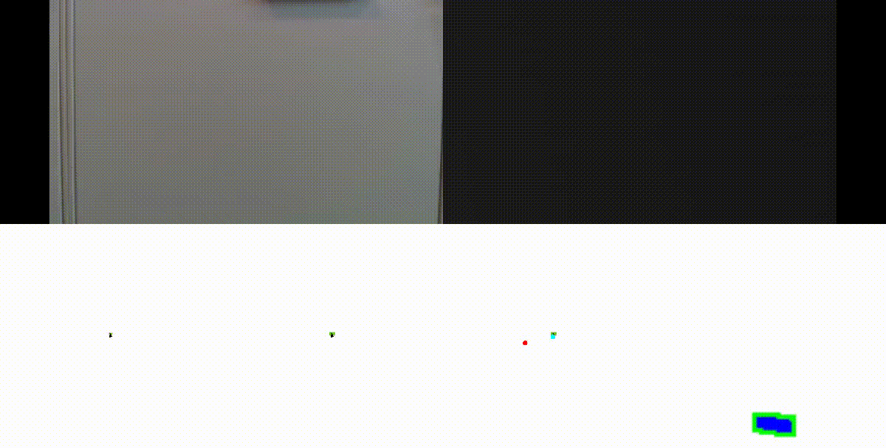
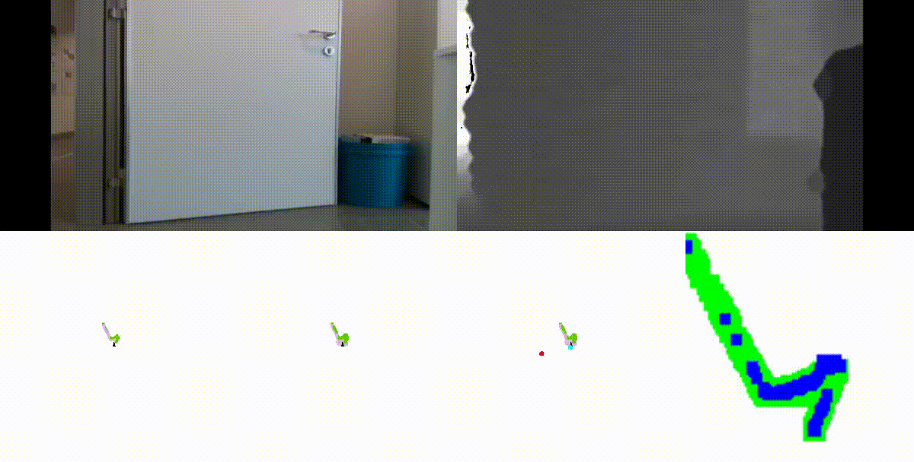

# Out of the Box: Embodied Navigation in the Real World

This is the PyTorch implementation for our paper:

[**Out of the Box: Embodied Navigation in the Real World**](https://arxiv.org/abs/2105.05873)<br>
__***Roberto Bigazzi***__, Federico Landi, Marcella Cornia, Silvia Cascianelli, Lorenzo Baraldi, Rita Cucchiara<br>


## Table of contents
   1. [LoCoNav](#loconav)
   1. [Desktop Installation](#desktop-installation)
   1. [LoCoBot Installation](#locobot-installation)
   1. [Pretrained Weights](#pretrained-weights)
   3. [Experiments](#experiments)
   4. [Citing LoCoNav](#citing-loconav)
   5. [License](#license)
   6. [Acknowledgments](#acknowledgments)


## LoCoNav

### Approach Overview
<p align="center">

</p>
  
### Samples of Navigation Episodes in the Real World
<p align="center">
  
  &nbsp;
  
</p>
<p align="center">
  
  &nbsp;
  
</p>


## Desktop Installation

1. Create an environment with conda:
    ```
    conda create -n loconav python=3.6 cmake=3.14.0
    source activate loconav
    ```
    
2. Install [Habitat-Lab](https://github.com/facebookresearch/habitat-lab):
    ```
    mkdir environments
    cd environments
    git clone --branch stable https://github.com/facebookresearch/habitat-lab.git
    cd habitat-lab
    pip install -r requirements.txt
    python setup.py develop --all
    ```
    
3. Install [Habitat-Sim](https://github.com/facebookresearch/habitat-sim):
    ```
    cd ..
    git clone --branch stable https://github.com/facebookresearch/habitat-sim.git
    cd habitat-sim
    pip install -r requirements.txt
    sudo apt-get update || true
    sudo apt-get install -y --no-install-recommends \
          libjpeg-dev libglm-dev libgl1-mesa-glx libegl1-mesa-dev mesa-utils xorg-dev freeglut3-dev
    ```
    Optional arguments *--headless* for headless systems and *--with-cuda* for systems with CUDA:
    ```
    python setup.py install --headless --with-cuda
    ```
    
4. Clone this repository:
    ```
    git clone --recursive https://github.com/aimagelab/LoCoNav
    cd LoCoNav
    ```
    
5. Download the scene datasets:
   * ***[Matterport3D dataset]***
   Download and extract the habitat zip archive using the official [Matterport3D](https://niessner.github.io/Matterport/) download script in `habitat-lab/data/scene_datasets/mp3d/` as follows: 
     ```
     python download_mp.py --task habitat -o data/scene_datasets/mp3d/
     ```
   * ***[Gibson dataset]***
      Download the habitat related dataset following the instructions from [Gibson](https://github.com/StanfordVL/GibsonEnv#database) repository. After downloading extract the dataset to folder `habitat-lab/data/scene_datasets/gibson/` (inside this folder you should have *.glb* files).  
 
6. Install [A* algorithm](https://github.com/srama2512/astar_pycpp):
    ```
    cd occant_utils/astar_pycpp
    make
    cd ../..
    ```
    
#### At this point you will be able to start the training script, so from now on instruction are focused on the deployment of the models to the LoCoBot Platform.

7. Install ***Enroot*** following the instructions on the [official repository](https://github.com/NVIDIA/enroot/blob/master/doc/installation.md).

8. Import [PyRobot+Habitat container](https://registry.hub.docker.com/r/soumith/pyrobot-and-habitat) from DockerHub:
    ```
    enroot import docker://soumith/pyrobot-and-habitat
    ```

9. Create enroot container on your machine:
    ```
    enroot create --name loconav soumith+pyrobot-and-habitat.sqsh
    ```
    
10. Start enroot container (mounting every path you need to access the cloned repository and your data):
    ```
    enroot start --rw --mount /path_to_loconav --mount /path_to_data --root loconav
    cd /path_to_loconav
    ```
    
11. Set up PyRobot communication on your machine substituting ***<IP_LOCOBOT>*** and ***<IP_DESKTOP>*** with the IP of the LoCoBot and the IP of your machine respectively. The LoCoBot and your machine should be connected to the same local network:
    ```
    echo export ROS_MASTER_URI=http://<IP_LOCOBOT>:11311 >> ~/.bashrc
    echo export ROS_HOSTNAME=<IP_DESKTOP> >> ~/.bashrc
    source ~/.bashrc
    ```
    
12. Load PyRobot Environment included in the container:
    ```
    load_pyrobot_env
    ```
   
#### If the LoCoBot is also set up, you will be able to run your evaluation scripts.
    
    
## LoCoBot Installation

1. Install Ubuntu 16.04 on the NUC (if not done already).

2. Install both [PyRobot and LoCoBot](https://pyrobot.org/docs/software#installing-both-pyrobot-and-locobot) specifying Python 3:
    ```
    sudo apt update
    sudo apt-get install curl
    curl 'https://raw.githubusercontent.com/facebookresearch/pyrobot/master/robots/LoCoBot/install/locobot_install_all.sh' > locobot_install_all.sh
    chmod +x locobot_install_all.sh
    ./locobot_install_all.sh -t full -p 3 -l interbotix
    ```

2. Set up PyRobot communication on the LoCoBot substituting ***<IP_LOCOBOT>*** with the IP of the LoCoBot in the local network:
    ```
    echo export ROS_MASTER_URI=http://localhost:11311 >> ~/.bashrc
    echo export ROS_HOSTNAME=<IP_LOCOBOT> >> ~/.bashrc
    source ~/.bashrc
    ```
    
3. Start the ROS server to handle commands sent from your machine:
    ```
    roslaunch locobot_control main.launch use_arm:=false use_base:=true use_camera:=true use_rviz:=false
    ```

#### At this point, the LoCoBot will receive and execute the evaluation scripts sent from your machine.


## Pretrained Weights
To download our pretrained weights for LoCoBot:
```
source activate loconav
pip install gdown
mkdir pretrained_ckpts
cd pretrained_ckpts
gdown https://drive.google.com/uc?id=1IGeEm-4hs39nCkbQP-FQd2XL6lzm20Lv
cd ..
```


## Experiments

### Training:
```
python -u run.py --exp-config configs/model_configs/lococcant/locobot_train.yaml --run-type train
```
### Evaluation on the LoCoBot:
```
python -u locobot_exp.py --exp-config configs/model_configs/lococcant/locobot_eval.yaml
```

## Citing LoCoNav

If you find our code useful for your research, please cite our paper:

#### Bibtex:
```
@article{bigazzi2021out,
  title={Out of the Box: Embodied Navigation in the Real World},
  author={Bigazzi, Roberto and Landi, Federico and Cornia, Marcella and Cascianelli, Silvia and Baraldi, Lorenzo and Cucchiara, Rita},
  journal={arXiv preprint arXiv:2105.05873},
  year={2021}
}
```

## License
LoCoNav is MIT licensed. See the [LICENSE file](LICENSE) for details.

The trained models and the exploration dataset are considered data derived from the correspondent scene datasets.
- Matterport3D based task datasets and trained models are distributed with [Matterport3D Terms of Use](http://kaldir.vc.in.tum.de/matterport/MP_TOS.pdf) and under [CC BY-NC-SA 3.0 US license](https://creativecommons.org/licenses/by-nc-sa/3.0/us/).
- Gibson based task datasets, the code for generating such datasets, and trained models are distributed with [Gibson Terms of Use](https://storage.googleapis.com/gibson_material/Agreement%20GDS%2006-04-18.pdf) and under [CC BY-NC-SA 3.0 US license](https://creativecommons.org/licenses/by-nc-sa/3.0/us/).

## Acknowledgments
This work has been supported by "Fondazione di Modena" under the project 
"AI for Digital Humanities" and by the national project "IDEHA: Innovation for Data Elaboration in Heritage Areas" (PON ARS01\_00421), cofunded by the Italian Ministry of University and Research.


